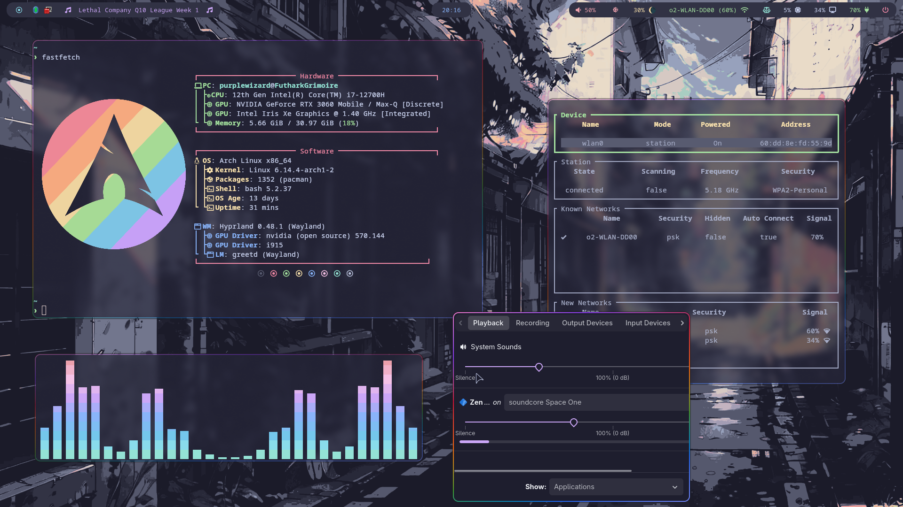

# Dotfiles

A simple repo to hold my arch `.config` files.

Images and some scripts are from various sources.
I tried to keep sources in the corresponding files.

I generally tried to stick with the catppuccin mocha colors.

The repo where I got all my wallpapers is [here](https://github.com/orangci/walls-catppuccin-mocha)

### Enjoy!

---

## Showcase



---

## Requirements

### Some of the packages needed:
- hyprland and its ecosystem
- uwsm
- grim
- impala (iwd frontend)
- pavucontrol
- qt5ct & qt6ct
- cava
- fastfetch
- kitty
- rofi-wayland
- swaync
- waybar
- yazi
- starship
- (Darkly)
- (Papyrus Icons)

### Needed folders and files:
- `~/wallpapers/`
```bash
mkdir ~/wallpapers/
```
- `~/Pictures/Screenshots/`
```bash
mkdir -p ~/Pictures/Screenshots/
```
- `~/.config/hypr/blue_filter`
```bash
echo "off" > ~/.config/hypr/blue_filter
```

---

## Info

### Scripts
Scripts ending with `.sh` found in `.config/hypr/` and `.config/waybar/` can be symlinked to `/usr/local/bin`
```bash
ln -s /path/<scriptname>.sh /usr/local/bin/<scriptname>
```
or alternatively moved there instead:
```bash
sudo mv /path/<scriptname>.sh /usr/local/bin/<scriptname>
```

### Services
Since these configs are made for `uwsm` make sure to use 
```bash
systemctl --user enable --now <service>.service
```
to autostart things like hyprpaper, hyprsunset or waybar.
Many apps come with their own service files pre included.

A .service and a .timer file are included under `.config/hypr/` that can be used to change wallpapers randomly every 10 minutes.
(Make sure hyprpaper is enabled/started as it is required for this to work.)
```bash
sudo mv ./.config/hypr/change_wallpaper_random.* /etc/systemd/user/
systemctl --user enable --now change_wallpaper_random.timer
```
The script is stolen from the hyprland wiki.

