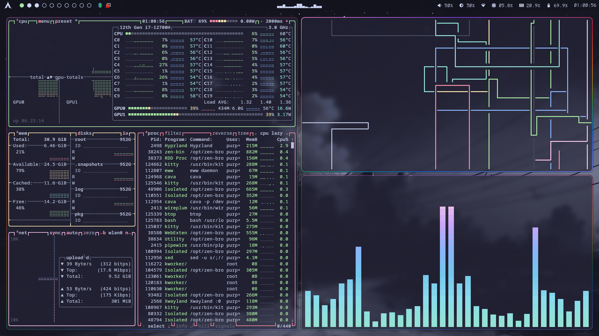
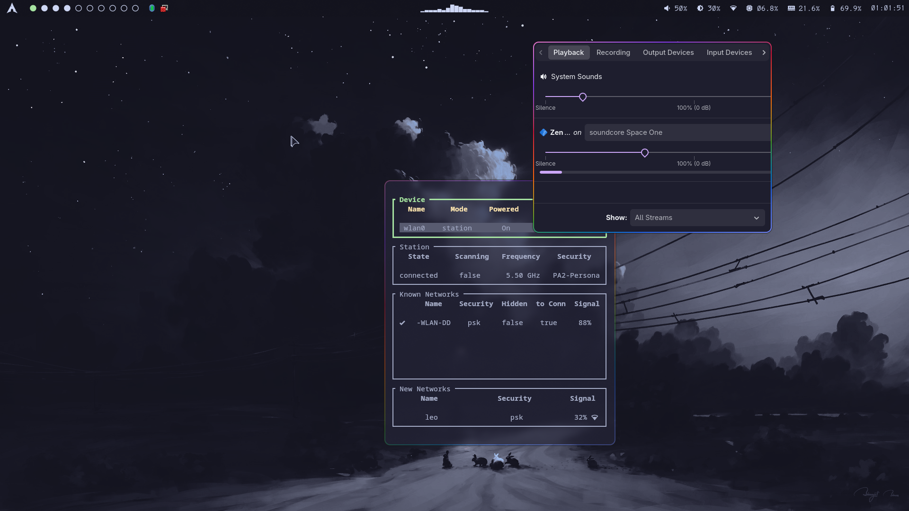
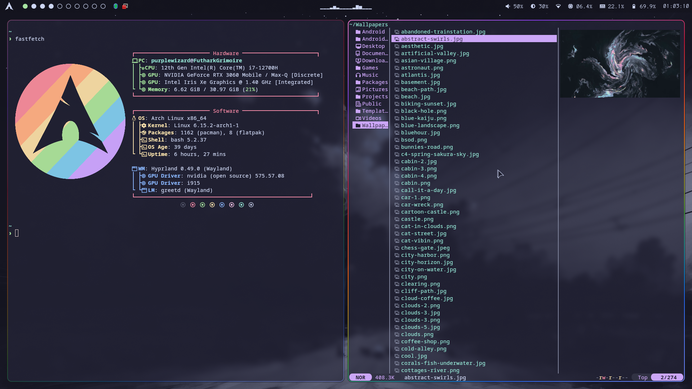
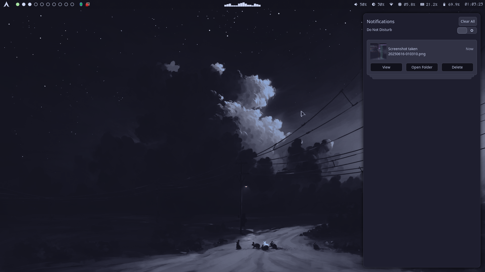
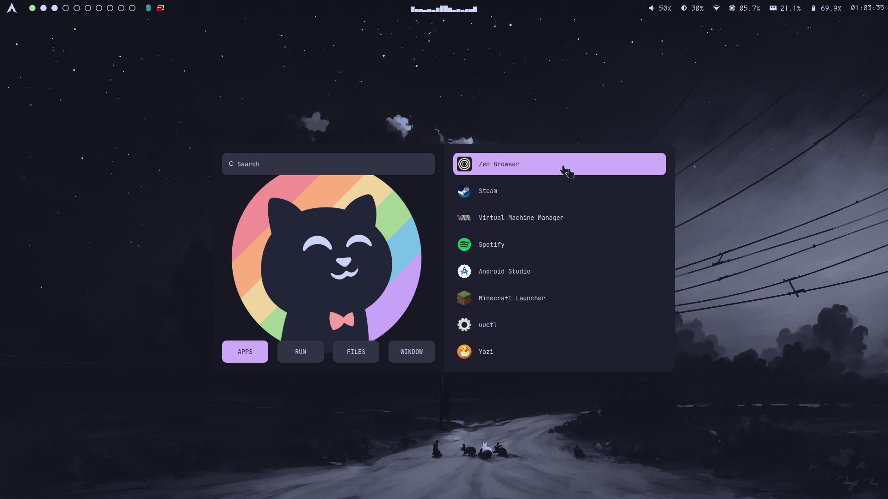
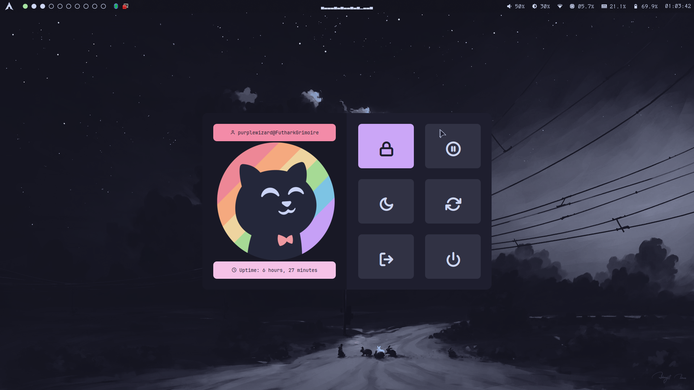
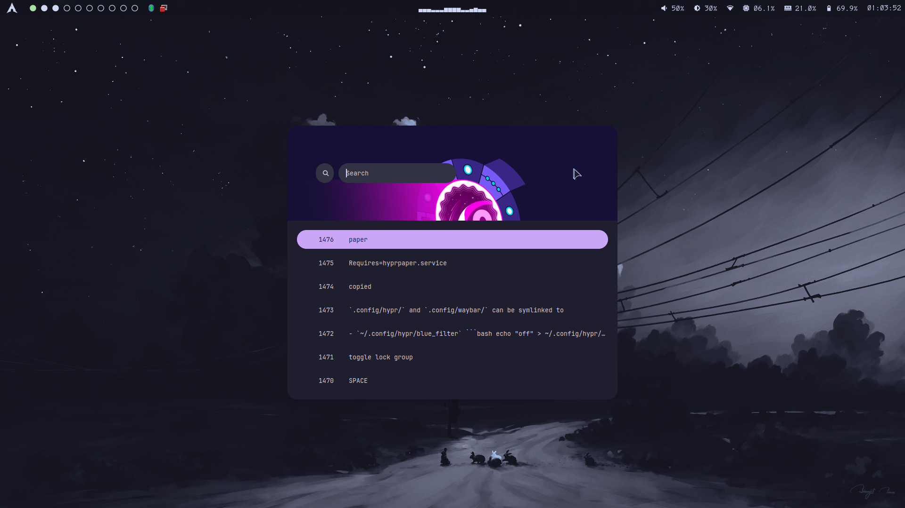

# Dotfiles

A simple repo to hold my arch `.config` files.

Images and some scripts are from various sources, most are from [Catppuccin](https://catppuccin.com/).
I tried to keep sources in the corresponding files.

I generally tried to stick with the catppuccin mocha colors.

The repo where I got all my wallpapers is [here](https://github.com/orangci/walls-catppuccin-mocha)
> [!WARNING]
 >  The EWW bar is currently under heavy work and its look might change heavily!

### Enjoy!

---

## Showcase








For those wondering I got my wallpapers mostly from [here](https://github.com/orangci/walls-catppuccin-mocha#), but there is also [this](https://notneelpatel.xyz/WallpaperThemeConverter/) great tool to make your own.

---

## Keybinds
| Bind | Description |
|------|------|
| SUPER + Q | kitty |
| SUPER + C | killactive |
| SUPER + M | powermenu |
| SUPER + SHIFT + M | kill session |
| SUPER + E | nemo |
| SUPER + V | toggle floating |
| SUPER + R | rofi menu |
| SUPER + P | pseudo # dwindle |
| SUPER + J | togglesplit # dwindle |
| SUPER + F | toggle fullscreen |
| SUPER + SHIFT + S | take screenshot | 
| SUPER + N | toggle sway notification center |
| SUPER + L | lock |
| SUPER + SHIFT + arrow keys | move window in direction |
| SUPER + ALT + SPACE | toggle Window grouping |
| SUPER + ALT + arrow keys | move Window into/out group |
| SUPER + ALT + CONTROL + SPACE | toggle lock group |
| SUPER + CONTROL + V | Show clipboard history |

---

## Requirements

### Some of the packages needed:
- hyprland and its ecosystem
- uwsm
- grim
- impala (iwd frontend)
- pavucontrol
- qt5ct & qt6ct
- cava
- fastfetch
- kitty
- rofi-wayland
- swaync
- waybar
- eww
- yazi
- starship

### Some needed Fonts:
- [DaddyTimeMono](https://github.com/BourgeoisBear/DaddyTimeMono)
- Noto Fonts (get all to be sure)
- various Nerd fonts.

### Needed folders and files:
- `~/wallpapers/`
```bash
mkdir ~/Wallpapers/
```
- `~/Pictures/Screenshots/`
```bash
mkdir -p ~/Pictures/Screenshots/
```

---

## Info

### Scripts
Scripts ending with `.sh` found in the `Scripts` Folder, and can be symlinked or moved to  `/usr/local/bin`
```bash
ln -s /full/path/<scriptname>.sh /usr/local/bin/<scriptname>.sh
```
or alternatively moved there instead:
```bash
sudo mv /full/path/<scriptname>.sh /usr/local/bin/<scriptname>.sh
```

### Services
Since these configs are made for `uwsm` make sure to use 
```bash
systemctl --user enable --now <service>.service
```
to autostart things like hyprpaper, hyprsunset or waybar.
Many apps come with their own service files pre included.

Sadly i cant be bothered to get eww to autostart with uwsm so its in the hyprland config.

A .service and a .timer file are included under the `Systemd` Folder, that can be used to change wallpapers randomly every 10 minutes.
(Make sure hyprpaper is enabled/started as it is required for this to work.)
```bash
sudo mv ./Systemd/change_wallpaper_random.* /etc/systemd/user/
systemctl --user enable --now change_wallpaper_random.timer
```
The script is stolen from the hyprland wiki.

